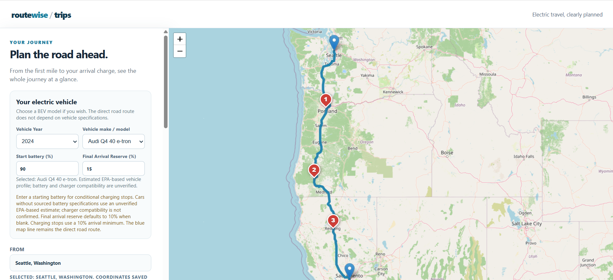
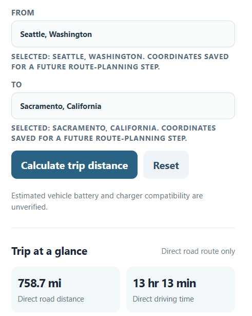
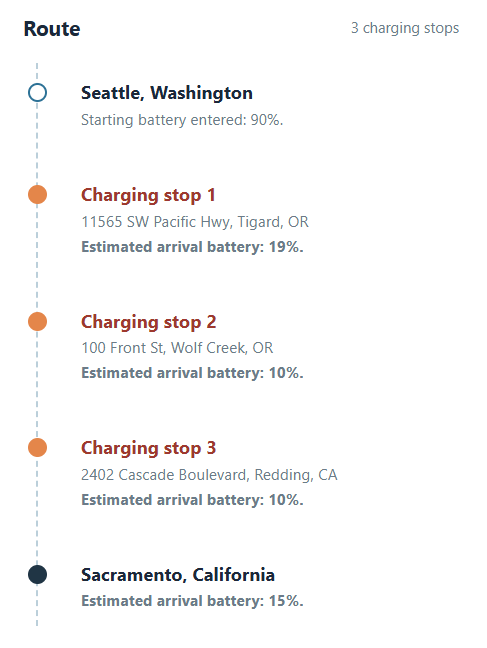

# RouteWise Trips

### An EV route and charging planner

RouteWise Trips is a web-based trip planner for battery-electric vehicles (BEVs). Enter a starting point and destination, choose a vehicle, and provide a starting battery level and destination arrival reserve. The application displays a road route and estimates the charging stops needed to complete the trip.

This project brings together a browser interface, Python planning logic, vehicle data, external routing and charging-station services, and automated tests. It is an ongoing portfolio project focused on making EV trip planning easier to understand while being transparent about the limits of estimated results.

**[Launch the live planner](https://ev-route-and-charging-planner.onrender.com/trip_planner_visual_prototype.html)**

> **First-visit note:** The demo runs on Render's free web-service tier. After a period of inactivity, the service can take about a minute to wake up. If you see a loading screen, please wait and try the page again. The screenshots below are available immediately, even while the demo starts.

## See the planner

### Trip-planning interface



*Choose a BEV and battery settings, enter a trip, and inspect the route on the map.*

### Route inputs and trip overview



*The example trip is from Seattle, Washington, to Sacramento, California. The interface shows the selected endpoints and direct-road-route estimates.*

### Charging-stop itinerary



*For this example, the planner lists three charging stops and estimates the battery on arrival at each stop. The displayed trip begins at 90% battery and targets 15% battery on arrival in Sacramento.*

## What the planner does

- Accepts an origin and destination as location inputs.
- Lets the user select a battery-electric vehicle and set a starting battery percentage.
- Accepts a target battery reserve for arrival at the final destination.
- Displays a road route and direct-road-route distance and driving-time estimates.
- Estimates the charging stops needed for the selected trip and vehicle assumptions.
- Numbers charging stops on the map and lists them in travel order.
- Shows estimated battery percentage on arrival at each listed stop.
- Distinguishes estimated or unverified vehicle information in the interface.

The goal is to make the planning result understandable: a visitor should be able to see the trip, identify where charging is expected, and understand the estimated battery level at each stop.

## Example trip

The screenshots show a trip from **Seattle, Washington, to Sacramento, California**, using a selected **2024 Audi Q4 40 e-tron** profile, a **90%** starting battery, and a **15%** final arrival reserve.

In the displayed example, the itinerary includes three charging stops:

| Stop | Location shown in the itinerary | Estimated battery on arrival |
| --- | --- | ---: |
| 1 | Tigard, Oregon | 19% |
| 2 | Wolf Creek, Oregon | 10% |
| 3 | Redding, California | 10% |
| Destination | Sacramento, California | 15% |

The interface also shows a **758.7-mile direct road distance** and **13 hr 13 min direct driving-time estimate** for this example. These are direct-route figures displayed by the application; do not interpret the driving-time figure as a complete door-to-door estimate including charging sessions.

Vehicle performance, charger suitability, and arrival-battery figures are estimates. The selected Audi profile is labeled as EPA-based in the interface, and its battery and charger compatibility are identified there as unverified.

## How it works

At a high level, the application:

1. Reads and validates the trip and battery inputs.
2. Identifies the selected vehicle profile and its planning assumptions.
3. Requests road-route information and searches for relevant public charging locations.
4. Evaluates whether the vehicle can reach the destination with the requested reserve or needs intermediate charging stops.
5. Produces an ordered itinerary with estimated battery percentages.
6. Displays the trip information and charging-stop markers in the browser.

The map's blue line represents the **direct road route** displayed by the application. The numbered markers identify the recommended charging stops. The current interface should not be interpreted as turn-by-turn navigation through every stop.

## Repository layout

```text
.
├── data/                     # Vehicle and other planning data
├── docs/
│   └── screenshots/          # Images displayed in this README
├── examples/                 # Example project inputs or outputs
├── notebooks/                # Exploratory analysis
├── setups/                   # Project setup or scenario-related files
├── src/                      # Python application and planning logic
├── tests/                    # Automated tests and regression coverage
├── web/                      # Browser interface and web assets
├── .gitignore
├── LICENSE
├── README.md
├── planning-result.json
├── requirements-deploy.txt
└── requirements.txt
```

The separation between `src/`, `tests/`, `web/`, and `data/` is intentional: application logic, verification, user interface, and reference data serve different purposes. The supporting folders keep documentation and development material out of the core application code.

## Running locally

### Prerequisites

- Python and `pip`
- Git
- API credentials for the external services used by the application

Clone the repository using its GitHub **Code** button, then open a terminal in the cloned project folder.

Create a virtual environment:

```powershell
python -m venv .venv
```

On Windows PowerShell, activate it with:

```powershell
.\.venv\Scripts\Activate.ps1
```

Install the project dependencies:

```powershell
python -m pip install -r requirements.txt
```

Configure the API credentials required by the application as environment variables. For the deployed version, the routing and charging-station credentials are configured outside the repository. **Do not commit API keys or a populated `.env` file.**

> **Application start command:** This README intentionally does not guess the Python entry point. Use the verified local start command for the current application version. The live interface is available through the demo link above.

## Tests

The `tests/` directory contains automated checks for application behavior and planning regressions. After installing the dependencies required for testing, run:

```powershell
python -m pytest
```

If `pytest` is not included in the installed dependency set, install the project's test dependencies before running the command. Tests that use local fixtures or mocked responses are particularly useful when external APIs are unavailable or rate-limited.

## APIs, security, and deployment

The application uses external services for road-routing and charging-station information. Results depend on those services being available and on their request limits.

- Keep API credentials in environment variables rather than in source files or browser-side code.
- Validate incoming trip requests before making external API calls.
- Monitor provider quotas on a public deployment.
- Use server-side safeguards to reduce accidental or abusive request volume.
- Treat a provider error or quota limit as a condition to explain to the user, not as a valid trip result.

The live demo is hosted on **Render's free web-service tier**. A cold start can delay the first page load after inactivity; this is a hosting limitation rather than a paid-domain requirement.

## Limitations

RouteWise Trips is an **estimation and portfolio project**, not a substitute for a vehicle's navigation system or confirmation from a charging network.

- Actual energy use varies with speed, terrain, weather, temperature, traffic, vehicle condition, and driving behavior.
- Vehicle profiles may rely on estimates; the interface flags information that has not been verified.
- Charger location data does not by itself guarantee that a charger is working, available, priced as expected, or compatible with the vehicle.
- Estimated arrival battery and stop recommendations are planning outputs, not guarantees.
- The displayed direct-route driving time should not be read as total trip time including charging.
- The displayed blue road route is not a promise that its geometry follows every recommended charging stop.

Before making a real trip, verify charger compatibility and availability, current vehicle range, and a safe reserve for the conditions.

## Next steps

- Expand and verify vehicle-profile data and document its sources.
- Improve the handling and presentation of charging-station compatibility and availability.
- Refine route and stop calculations against additional real-world trip scenarios.
- Add durable rate limiting, caching, and API-usage monitoring for a larger public audience.
- Improve documentation for the exact local start command and deployment configuration.
- Add continuous integration so automated tests run on each proposed code change.

## License

See [LICENSE](LICENSE) for this project's license terms.